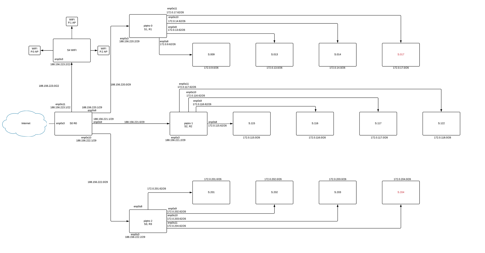

 ## 1. Ustalenie maski podsieci: 
    255.255.255.248 /29 - maska dla sieci na każdym z trzech pięter 
    255.255.254.192 /29 - maska dla każdego laboratorium (35)
    255.255.252.0 /22 - maska dla wifi (800)
 ----------------------------------------------------------
 ## 2. Ustalenie adresu sieci dla adresu 188.156.220.160:
 
 ### R0:
     Piętro 0 - 188.156.220.0/29
     Piętro 1 - 188.156.221.0/29
     Piętro 2 - 188.156.222.0/29
     WIFI - 188.156.223.0/22 
 ### R1: 
     S.009 - 172.0.9.0/26
     S.013 - 172.0.13.0/26
     S.014 - 172.0.14.0/26
     S.017 - 172.0.17.0/26
  ### R2: 
     S.115 - 172.0.115.0/26
     S.116 - 172.0.116.0/26
     S.117 - 172.0.117.0/26
     S.122 - 172.0.122.0/26
   ### R3: 
     S.201 - 172.0.201.0/26
     S.202 - 172.0.202.0/26
     S.203 - 172.0.203.0/26
     S.204 - 172.0.204.0/26
  ----------------------------------------------------------
  ## 3. Dodanie adresów IP:
  
  ### R0:
  
| karta sieciowa | adres karty | maska podsieci |
| --------- |:-------------| :---------------|
| ``enp0s8`` | ``188.156.220.1`` | ``255.255.255.248`` |
| ``enp0s9`` | ``188.156.221.1`` | ``255.255.255.248`` |
| ``enp0s10`` | ``188.156.222.1`` | ``255.255.255.248`` |
| ``enp0s11`` | ``188.156.223.1`` | ``255.255.252.0`` |

      
  ### R1:
  
| karta sieciowa | adres karty | maska podsieci |
| --------- |:-------------| :---------------|
| ``enp0s3`` | ``188.156.220.2`` | ``255.255.255.248`` |
| ``enp0s8`` | ``172.0.9.62`` | ``255.255.255.192`` |
| ``enp0s9`` | ``172.16.13.62`` | ``255.255.255.192`` |
| ``enp0s10`` | ``172.16.14.62`` | ``255.255.255.192`` |
| ``enp0s11`` | ``172.16.17.62`` | ``255.255.255.192`` |
   
    
   ### R2:
   
| karta sieciowa | adres karty | maska podsieci |
| --------- |:-------------| :---------------|
| ``enp0s3`` | ``188.156.221.2`` | ``255.255.255.248`` |
| ``enp0s8`` | ``172.0.115.62`` | ``255.255.255.192`` |
| ``enp0s9`` | ``172.0.116.62`` | ``255.255.255.192`` |
| ``enp0s10`` | ``172.0.117.62`` | ``255.255.255.192`` |
| ``enp0s11`` | ``172.0.122.62`` | ``255.255.255.192`` |

   ### R3:
   
| karta sieciowa | adres karty | maska podsieci |
| --------- |:-------------| :---------------|
| ``enp0s3`` | ``188.156.222.2`` | ``255.255.255.248`` |
| ``enp0s8`` | ``172.0.201.62`` | ``255.255.255.192`` |
| ``enp0s9`` | ``172.0.202.62`` | ``255.255.255.192`` |
| ``enp0s10`` | ``172.0.203.62`` | ``255.255.255.192`` |
| ``enp0s11`` | ``172.0.204.62`` | ``255.255.255.192`` |

      
 
 
----------------------------------------------------------
## 4. Włączenie port forwardingu:
R0, R1, R2, R3

``nano /etc/sysctl.d/99-sysctl.conf``
``odkomentować net.ipv4.ip_forward=1``

## 5. DHCP:
### R1, R2, R3, dla R0 tylko enp0s11:
  ``nano /etc/default/isc-dhcp-server``
  
  ``odkomentować config DHCPv4 i dopisać inferfejsy na dole``
  
   
   ``nano /etc/dhcp/dhcpd.conf`` -> konfiguracja sieci. Proces należy powtórzyć dla każdego labolatorium.

 
  
    
 ### R0:
 

----------------------------------------------------------
## XX. Diagram:

