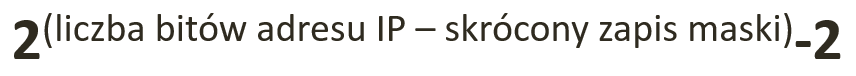

Struktura adresu IP
-------------------

```192.168.100.192```
```255.255.255.0```

Adres sieci
-----------

1. IP + maska => BIN 
2. AND => IP, maska
3. Konwersja do DEC

Najprosciej - bity maski - bity z adresu sieci -> dla maski /16 bierzemy druga liczbe, zamieniamiy na BIN, bierzemy druga liczbe z maski, zamieniamy na BIN, robimy na obu liczbach AND, adres IP to liczba przed zamieniona na BIN + wynik z ANDa + zera. 

Adres rozgłoszeniowy (broadcast)
-----------

1. Maska => NOT
2. Konwersja do DEC
3. Otrzymaną liczbę w systemie DEC dodajemy do adresu sieci. 


Podział na równą ilość podsieci
-------------------------------

```2^S >= n```

Chcemy 7 -> 2^3 >= 7

Maska -> 255.255.255.11100000 -> 255.255.255.224 -> /27


Wyznaczenie ilości hostów
-------------------------------



Wprowadzenie
------------

------------------------------
| dziesiętnie |  binarnie   | 
| --------- |:-------------| 
| ``10``  | 00001010 | 
| ``92``  | 01011100 | 
| ``37``  | 00100101 | 
| ``240`` | 11110000 | 
| ``192`` | 11000000 | 
| ``255`` | 11111111 | 
| ``128`` |	10000000 | 
| ``168`` | 10101000 | 


------------------------------
| binarnie |  dziesiętnie   | 
| --------- |:-------------| 
| ``00100000``  | 32 | 
| ``11111000``  | 248 | 
| ``10100000``  | 160 | 
| ``00110000`` | 48 | 
| ``10101100`` | 172 | 
| ``01000000`` | 64 | 
| ``11111100`` | 252 | 
| ``01100010`` | 98 | 
 
Notacja CIDR
------------
 
------------------------------
| maska |  /(X) x - liczba bitów   | 
| --------- |:-------------| 
| ``255.255.255.0``   | /24 | 
| ``255.255.255.128``     | /25 | 
| ``255.255.252.0``   | /22 | 
| ``255.255.254.0``   | /23 | 
| ``255.255.255.240`` | /28 | 
| ``255.248.000.000``     | /13 | 

------------------------------
| CIDR |  Maska   | 
| --------- |:-------------| 
| ``/8``    | 255.0.0.0 | 
| ``/20``   | 255.255.240.0 | 
| ``/30``   |	255.255.255.252 | 
| ``/16``   | 255.255.0.0 | 
| ``/27``   | 255.255.255.224 | 
| ``/11``   | 255.224.0.0 | 


Liczba hostów
-------------

------------------------------
| sieć |  liczba   | 
| --------- |:-------------| 
| ``10.0.0.0/8``    |	16 777 214 | 
| ``172.16.0.0/16``   | 65 534 | 
| ``192.168.1.0/24``   | 254 | 
| ``192.168.1.0/27``   | 30 | 
| ``192.168.1.0/29``   | 6 | 
| ``192.168.1.0/31``   | 0 | 

* liczba 0 w masce?


Parametry na podstawie adresu
-----------------------------

Mając dany adres hosta i maskę znajdź:
  * adres sieci
  * początkowy adres hosta w sieci
  * liczbę hostów w zadanej podsieci ```2^(32 bity - bity maski maska) - 2 (siec i broadcast)```
  * końcowy zakres adresu hosta w sieci
  * adres rozgłoszeniowy
  
  ------------------------------
| Parametr |  wartość   | 
| --------- |:-------------| 
| ``ip``    | 192.168.1.145| 
| ``maska``   | 255.255.255.128 | 
| ``adres sieci``   | 192.168.1.128 |
| ``liczba hostów``   | 126 |
| ``host - min``   | 192.168.1.129 | 
| ``host - max``   | 192.168.1.254 | 
| ``broadcast``   | 192.168.1.255 | 
 
Zadanie
------------

0. Znajdz wszystkie parametry sieci dla hosta o adresie 172.16.128.64 / 16
  
------------------------------
| Parametr |  wartość   | 
| --------- |:-------------| 
| ``ip``    | 172.16.128.64 | 
| ``maska``   | 255.255.0.0 | 
| ``adres sieci``   | 172.16.0.0|
| ``liczba hostów``   | 65 534|
| ``host - min``   | 172.16.0.1| 
| ``host - max``   | 172.16.255.254 | 
| ``broadcast``   | 172.16.255.255| 

1.
  * Podziel sieć ```192.168.1.0``` na 16 równych podsieci
  
----------------------------------------------------------
| Adres sieci | zakres hostów | Adres Rozgłoszeniowy |
| --------- |:-------------| :---------------|
| ``192.168.1.0`` | ``192.168.1.1 - 192.168.1.14`` | ``192.168.1.15`` |
| ``192.168.1.16`` | ``192.168.1.17 - 192.168.1.30``  | ``192.168.1.31`` |
| ``192.168.1.32`` | ``192.168.1.33 - 192.168.1.46``  | ``192.168.1.47`` |
| ``192.168.1.48`` | ``192.168.1.49 - 192.168.1.62`` | ``192.168.1.63`` |
| ``192.168.1.64`` | ``192.168.1.65 - 192.168.1.78`` | ``192.168.1.79`` |
| ``192.168.1.80`` | ``192.168.1.81 - 192.168.1.94`` | ``192.168.1.95`` |
| ``192.168.1.96`` | ``192.168.1.97 - 192.168.1.110``  | ``192.168.1.111`` |
| ``192.168.1.112`` | ``192.168.1.113 - 192.168.1.126``  | ``192.168.1.127`` |
| ``192.168.1.128`` | ``192.168.1.129 - 192.168.1.142``  | ``192.168.1.143`` |
| ``192.168.1.144`` | ``192.168.1.145 - 192.168.1.158``  | ``192.168.1.159`` |
| ``192.168.1.160`` | ``192.168.1.161 - 192.168.1.174``  | ``192.168.1.175`` |
| ``192.168.1.176`` | ``192.168.1.177 - 192.168.1.190``  | ``192.168.1.191`` |
| ``192.168.1.192`` | ``192.168.1.193 - 192.168.1.206``  | ``192.168.1.207`` |
| ``192.168.1.208`` | ``192.168.1.209 - 192.168.1.222``  | ``192.168.1.223`` |
| ``192.168.1.224`` | ``192.168.1.225 - 192.168.1.238``  | ``192.168.1.239`` |
| ``192.168.1.240`` | ``192.168.1.241 - 192.168.1.254``  | ``192.168.1.255`` |

2. 
  * Podziel sieć ``172.16.0.0/16`` na 6 równych podsieci.

3. 
  * Podziel sieć ``192.168.1.0/24``, tak aby każda podsieć miała 11 użytkowników.

4. 
  * Podziel sieć ``10.0.0.0/8`` na 5 podsieci. 
    * Podsieć A ma posiadać 100 000 użytkowników,
    * B – 10 000 użytkowników
    * C – 3 000 użytkowników
    * D – 500 użytkowników
    * E – 2 użytkowników.
    *
    
    
    
