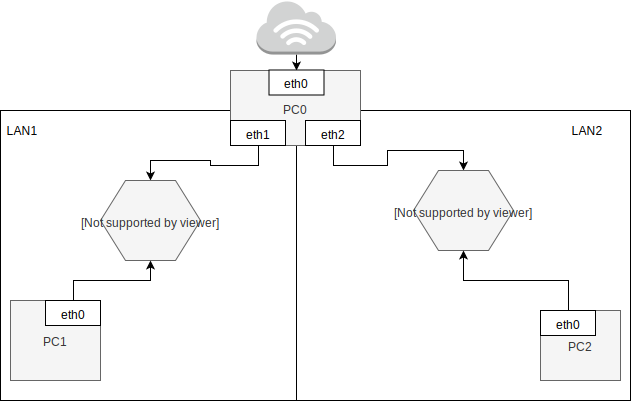
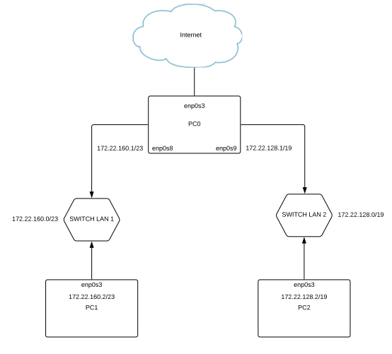

Zadanie 1
---------

1. Zaprojektuj oraz przygotuj prototyp rozwiązania z wykorzystaniem oprogramowania ``VirtualBox`` lub podobnego. 
Zaproponuj rozwiązanie spełniające poniższe wymagania:
   * Usługodawca zapewnia domunikację z siecią internet poprzez interfejs ``eth0`` ``PC0``
   * Zapewnij komunikację z siecią internet na poziomie ``LAN1`` oraz ``LAN2``
   * Dokonaj takiego podziału sieci o adresie ``172.22.128.0/17`` aby w ``LAN1`` można było zaadresować ``500`` adresów natomiast w LAN2 ``5000`` adresów    
   * Przygotuj dokumentację powyższej architektury w formie graficznej w programie ``DIA``
 ## 1. Ustalenie maski podsieci: 
    * LAN 1 - 500 hostów - 255.255.254.0 (/23) (512)
    * LAN 2 - 5000 hostów - 255.255.224.0 (/19) (8192)
 ----------------------------------------------------------
 ## 2. Ustalenie adresu sieci dla adresu 172.22.128.0: 
    Rozpoczynamy od LAN 2, ponieważ przy dzieleniu zaczynamy od największej liczby hostów. Domyślna maska /17.
    * LAN 2 - 172.22.128.0/19
    * LAN 1 - 172.22.160.0/23
    
| Adres sieci | zakres hostów | Adres Rozgłoszeniowy |
| --------- |:-------------| :---------------|
| ``172.22.128.0`` | ``172.22.128.1 - 172.22.159.254`` | ``172.22.159.255`` |
| ``172.22.160.0`` | ``172.22.160.1 - 172.22.161.254``  | ``172.22.161.255`` |
----------------------------------------------------------
## 3. Konfiguracja sprzętu:
### 3.1 Dodanie adresów IP:
``nano/etc/network/interfaces``
#### PC0:

#### PC1: 

#### PC2: 

### 3.2 Uruchomienie routingu na PC0: 
``echo 1 > /proc/sys/net/ipv4/ip_forward``

### 3.3 Reguła masquarade dla PC0: 

  ``iptables -t nat -A POSTROUTING -s 172.22.128.0/19 -o enp0s3 -j MASQUERADE``
  
  ``iptables -t nat -A POSTROUTING -s 172.22.160.0/23 -o enp0s3 -j MASQUERADE``

### 3.4 Ustalenie routingu:
#### PC1: 
``up ip route add default via 172.22.160.1``
#### PC2:
``up ip route add default via 172.22.128.1``

### (Opcjonalne) DNS: 
#### PC0: 

``nano /etc/hosts``

#### PC1 i PC2: 

``nano /etc/resolv.conf``

----------------------------------------------------------
## XX. Diagram:

