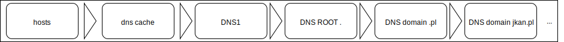
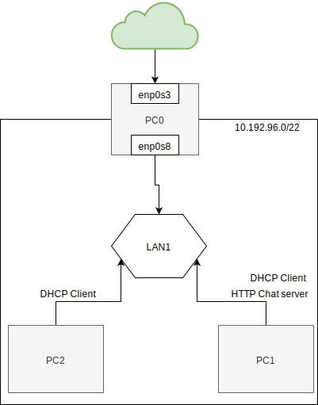

DNS - Network address translation
----------------------------------

  * http://www.thekelleys.org.uk/dnsmasq/doc.html
  * https://www.isc.org/downloads/bind/
  
  

Zadanie
------------



1.
   * Przygotuj konfigurację sieci zgodnie z powyższym diagramem
   * Zweryfikuj poprawność połączenia z siecią internet dla ``PC0``
      * adresacja
   * Skonfiguruj serwer ``DHCP`` dla ``PC0`` tak aby wszystkie nowo przyłączone urządzenia uzyskały właściwą konfigurację
      ``ip`` 
      -------------------------
      | klucz    |  wartość   |
      | ------------- |:-------------|  
      |   ``ip``   |   ``10.192.192.0 - 10.192.200.0``  | - ip addr add, ip link set 
      |   ``mask`` |   ``255.255.252.0``                |
      |   ``gateway`` |     ``{wlasciwe ip}``              |
      |   ``dns``  |  ``{wlasciwe ip}``                 |
    
   ```
    * ustawic siec nat oraz nat dla serwera, siec nat dla komputera
    * apt-get install isc-dhcp-server
    * nano /etc/default/isc-dhcp-server
    * interfacesv4 = nazwa karty, ktora slucha
    * nano /etc/dhcp/dhcpd.conf
    * zjechac na dol:
      * subnet 10.192.96.0 netmask 255.255.252.0 {
      * range 10.192.98.0 10.192.98.0;
      * option routers 10.192.96.1;
      * option domain-name-servers 10.192.96.1, 1.1.1.1;}
    * systemctl start isc-dhcp-server
    * systemctl status isc-dhcp-server (sprawdzenie czy dhcp dziala)
    * dhclient -r enp0s3 - czyszczenie
    * dhclient -v enp0s3 - przypisanie od nowa
    * ustanowienie statycznego ip - nano /etc/dhcp/dhcpd.conf - na dole:
   host httpchat {
    hardware ethernet mac adress;
    fixed-address 10.192.96.10;
   }
   *systemctl restart isc-dhcp-server
   *apt-get install dnsutils -> dig/nslookup adres
   ```
   
   ``notatka do 7 tematu``
   * echo 1 > /proc/sys/net/ipv4/ip_forward
   * iptables-t nat -A POSTROUTING -o enp0s3 -s 10.192.96.0/22 -j MASQUERADE
   `cd`
   * /etc/hosts - ustawic dns
   * apt-get install dnsmasq
   
   
   
   

   
   
   * ---------------
   * Uruchom usługe ``dnsmasq`` dla ``PC0``
   * Skonfiguruj usługę ``DHCP`` tak aby ``PC1`` zawsze uzyskał ten sam adres IP
   * Dokonaj odpowiedniej modyfikacji konfiguracji tak aby z dowolnego komputera w sieci 
   przy komunikacji z adresem ``chat.mydomain.local`` został rozwinięty na adres komputera ``PC1``
   * Uruchom usługę ``http-chat`` na komputerze ``PC1``
   * Przetestuj działanie aplikacji ``http-chat`` z ``PC2`` lub innym nowo podłączonym do sieci\
 
   

Przydatne polecenia
-------------------


| komenda    |  przykład   | opis  |
| ------------- |:-------------| :---------------| 
|   ``nslookup``    | ``nslookup uek.krakow.pl`` | kwerenda do serwera dns |
|   ``dig``         | ``dig uek.krakow.pl``      | kwerenda do serwera dns |
|    /etc/init.d/networking restart | | wyczyść lokalny cache dns |   


Zadanie do domu
---------------

1. Przygotuj system z trybem graficznym, oraz zainstalowanym programem 
``wireshark`` https://www.wireshark.org
2. Przetestuj komunikację z ``http-chat`` dla nowo zainstalowanego systemu
  
